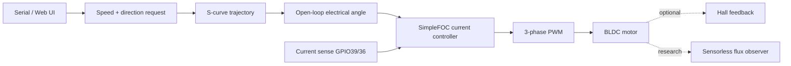

# MaxxFan BLDC Controller

**ESP32 + SimpleFOC firmware for converting a MaxxFan-style roof fan to a quiet, controllable BLDC drive.**


> **Project status:** active development. `main` is the conservative hardware-known-good reference. New motor-control ideas are developed and tested on separate branches before promotion.

## What this project does

This firmware drives a **StepperOnline 57BYA54-12-01 BLDC motor** from an **MKS ESP32 FOC Mega** as a replacement drive for a MaxxFan-style ventilation fan.

The project currently supports:

- open-loop velocity control with **real phase-current FOC**
- optional Hall-sensor closed-loop development path
- smooth S-curve speed changes and direction changes
- Wi-Fi control and a lightweight browser UI
- persistent settings in ESP32 NVS
- current and voltage limits for commissioning
- experimental **dynamic q-current** control on a dedicated branch
- experimental **sensorless flux-observer** work on a dedicated research branch

## Hardware target

| Item | Configuration |
|---|---|
| Controller | MKS ESP32 FOC Mega |
| MCU | Classic ESP32 |
| Motor | StepperOnline 57BYA54-12-01 |
| Motor supply | 12 V nominal |
| Pole pairs | 2 |
| PWM U / V / W | GPIO 32 / 33 / 25 |
| Driver enable | GPIO 12 |
| Current sense A / B | GPIO 39 / 36 |
| Current shunt | 0.01 Ω |
| Current amplifier gain | 50 V/V |
| Hall A / B / C | GPIO 18 / 19 / 15 |

Hall sensors are **not required for the current OPEN_CURRENT_FOC commissioning path**.

## Repository branches

| Branch | Purpose | Maturity |
|---|---|---|
| [`main`](../../tree/main) | conservative hardware-known-good reference | ✅ reference baseline |
| [`develop`](../../tree/develop) | latest integrated firmware candidate | 🧪 hardware requalification pending |
| [`feature/dynamic-current`](../../tree/feature/dynamic-current) | adaptive q-current instead of fixed open-loop current | 🧪 implemented, bench validation pending |
| [`research/sensorless-foc`](../../tree/research/sensorless-foc) | passive sensorless angle/RPM observer and handover research | 🔬 research/probe stage |

## Quick start

### 1. Clone and choose a branch

For the safest reference behavior:

```bash
git clone https://github.com/jboehm1/maxxfan-bldc-controller.git
cd maxxfan-bldc-controller
git checkout main
```

For current development testing:

```bash
git checkout develop
```

### 2. Arduino dependencies

The current development target uses:

- Arduino IDE / Arduino CLI
- ESP32 Arduino core
- SimpleFOC 2.4.x
- AsyncTCP
- ESP Async WebServer

The current development environment targets Arduino-ESP32 **3.3.11** and ESP Async WebServer **3.12.0**. Exact compatibility should still be verified on the target before calling a build release-qualified.

### 3. First bench test

Use conservative limits first. A typical commissioning setup is:

```text
Supply              12 V
Bench supply limit  2 A
Motor current limit 0.6 A
Motor voltage limit 1.5–3.0 V
Initial max speed   600 rpm
```

Then test in this order:

1. boot with the fan stopped
2. verify OPEN mode if no Hall sensors are connected
3. start at low speed
4. test a normal speed change
5. test STOP
6. test direction reversal
7. repeat with the browser UI open
8. increase speed/limits only after current, sound and temperature look reasonable

See [`docs/TEST_PLAN.md`](docs/TEST_PLAN.md) for the complete validation checklist.

## Control architecture



### Why current sensing matters

In the current open-loop configuration, rotor angle is commanded rather than measured, but the motor phase current is measured physically. That allows real d/q current regulation even without Hall sensors.

The experimental `feature/dynamic-current` branch separates:

- **current limit** — hard ceiling
- **Iq request** — torque-producing current actually requested as a function of commanded speed

This is intended to reduce unnecessary current and heating at low speed while retaining startup/load margin.

## Sensorless FOC research

The `research/sensorless-foc` branch contains a **passive observer probe**. It estimates rotor flux angle and RPM while the existing open-loop controller still drives the motor.

That separation is intentional: the observer must demonstrate stable, believable estimates across the useful speed range before it is allowed to control commutation.

Planned progression:

```text
open-loop start
      ↓
passive observer locks
      ↓
validate angle / RPM / flux quality
      ↓
blend commanded angle → observed angle
      ↓
sensorless closed-loop
      ↓
fallback if lock is lost
```

See [`docs/SENSORLESS_FOC_RESEARCH.md`](docs/SENSORLESS_FOC_RESEARCH.md).

## Safety and validation

This is **experimental motor-control firmware**, not a certified appliance controller.

A change is not considered ready for `main` until it has passed, on the actual motor/controller/fan:

- target compile
- controlled bench startup
- smooth speed-change test
- smooth STOP test
- smooth reverse test
- reverse-during-ramp test
- GUI-open / Wi-Fi interference test
- current telemetry sanity check
- supply-current observation
- thermal observation
- extended runtime test

Keep the fan mechanically clear during commissioning. Software current limits do not replace proper electrical protection, wiring, fusing, or thermal validation.

## Project layout

```text
firmware/
  MaxxFan_MKS_ESP32_FOC_Mega/
    MaxxFan_MKS_ESP32_FOC_Mega.ino

reference/
  v0.3.7-known-good/
    MaxxFan_v0.3.7_TEST_known_good.ino

docs/
  BRANCHING.md
  DEVELOP_STATUS.md
  ROADMAP.md
  SENSORLESS_FOC_RESEARCH.md
  TEST_PLAN.md
```

Feature branches can add their own experiments and documentation without contaminating the stable reference.

## Development workflow

```text
feature / research branch
          ↓
      bench test
          ↓
       develop
          ↓
 integration test
          ↓
        main
          ↓
     version tag
```

See [`docs/BRANCHING.md`](docs/BRANCHING.md) and [`CHANGELOG.md`](CHANGELOG.md).

## Versioning

Some historical `0.3.x` names were created during rapid commissioning and are not strictly chronological. New hardware-qualified releases should use normal semantic versioning. The intended next clean release line is **v0.4.x**.

## Credits

Built around [SimpleFOC](https://simplefoc.com/) and the ESP32 ecosystem.

This is an independent experimental project and is not affiliated with or endorsed by Maxxair, Makerbase/MKS, StepperOnline, or the SimpleFOC project.
